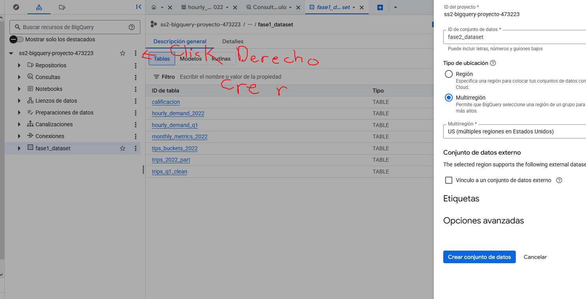

# Fase 2

## Integrantes
  
**Nombre:**  Daniel Izas
**Carnet:** 201801105
---

**Nombre:** Diego Perez
**Carnet:** 2021065038
---

## Crear nueva dataset para esta fase (Opcional)
  
1. Entra a **BigQuery Studio** con el proyecto `ss2-bigquery-proyecto-473223.` seleccionado.

2. Haz clic en **+ Create dataset**.

3. Configura:

- **Dataset ID:** `fase1_dataset`
- **Location:** `US`

- Deja las demás opciones por defecto.
Si lo vbemos necesario crear un nuevo dataset para esta fase.



## Crear Tabla de base limpia q1

```sql
CREATE OR REPLACE TABLE `ss2-bigquery-proyecto-473223.fase2_dataset.trips_q1_feature`
PARTITION BY  DATE(pickup_datetime)
CLUSTER BY pickup_loc AS
SELECT 
  --Partición explícita
  DATE(pickup_datetime) AS pickup_date,
  --Label
  CASE WHEN tip_amount > 0 THEN 1 ELSE 0 END AS tipped,
  --Señales temporales
  EXTRACT(HOUR FROM pickup_datetime) AS hour_of_day,
  EXTRACT(DAYOFWEEK FROM pickup_datetime) AS day_of_week,
  EXTRACT(DAY FROM pickup_datetime) AS day,
  EXTRACT(MONTH FROM pickup_datetime) AS month,
  --Magnitudes
  trip_distance, 
  total_amount,
  fare_amount,
  passenger_count,
  -- Señales de ubicación
  CAST(pickup_location_id AS STRING) AS pickup_loc,
  CAST(dropoff_location_id AS STRING) AS dropoff_loc,
  -- Conservamos timestamp
  pickup_datetime 

FROM `ss2-bigquery-proyecto-473223.fase1_dataset.trips_q1_clean`
WHERE data_file_month BETWEEN 1 AND 3
  AND trip_distance > 0
  AND total_amount >= 0
  AND fare_amount >= 0
  AND passenger_count BETWEEN 1 AND 6;

```

### Crear Vista en vase a la tabla de viajes del cuartil 1

```sql

CREATE OR REPLACE VIEW `ss2-bigquery-proyecto-473223.fase2_dataset.view_features_trip`AS 
SELECT * FROM `ss2-bigquery-proyecto-473223.fase2_dataset.trips_q1_feature`;

```

## Estrategia de división Train/Test

- Primero y Segundo mes de Train (Entrenar con datos al modelo)

- Tercero mes de Test (Entrentar con comparacion entre predicción y datos reales al modelo)

Creamos vistas para facilitar filtros coherentes y reproducibles.

```sql
--- Entrenamiento
CREATE OR REPLACE VIEW `ss2-bigquery-proyecto-473223.fase2_dataset.v_features_train` AS
SELECT *
FROM `ss2-bigquery-proyecto-473223.fase2_dataset.trips_q1_feature`
WHERE month BETWEEN 1 AND 2;
--- Prueba
CREATE OR REPLACE VIEW `ss2-bigquery-proyecto-473223.fase2_dataset.v_features_test` AS
SELECT *
FROM `ss2-bigquery-proyecto-473223.fase2_dataset.trips_q1_feature`
WHERE month = 3;

```

## Creación de los Modelos de Machine Learning
