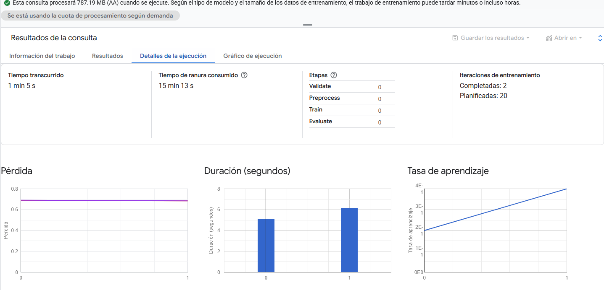
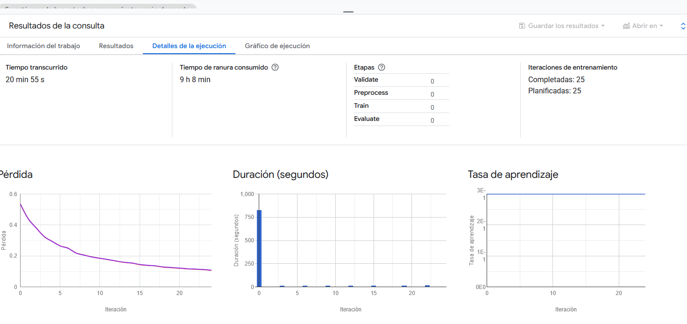
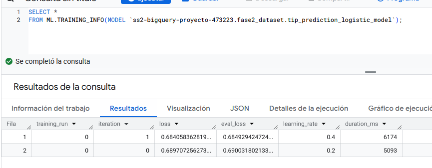
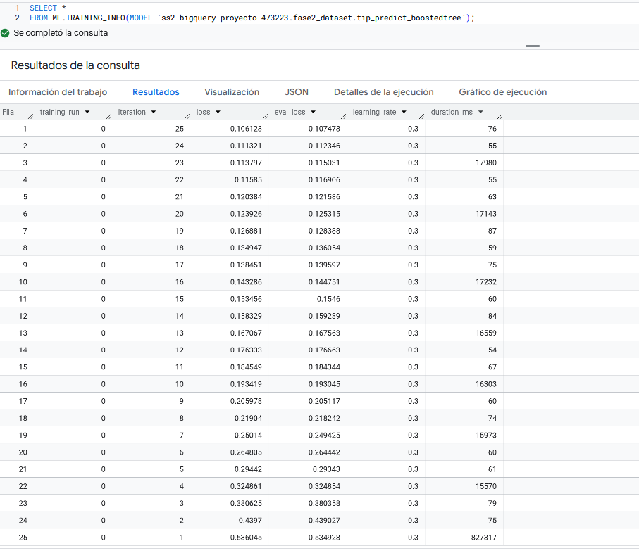
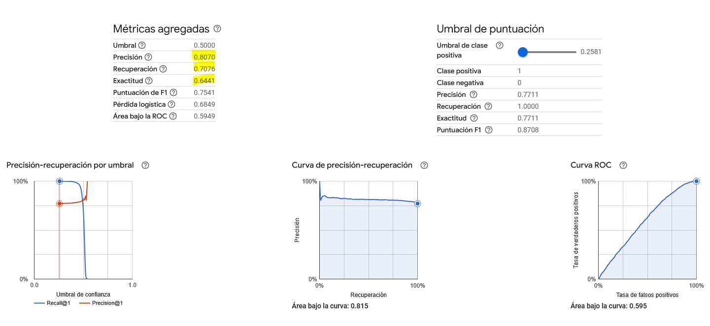
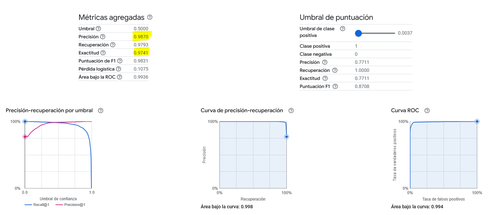
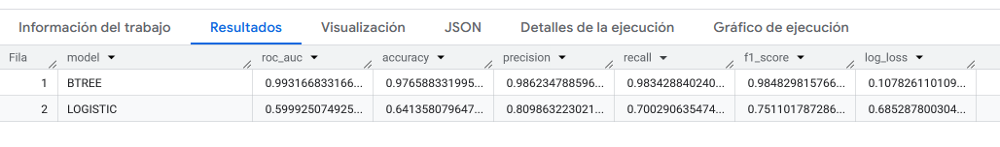

# Fase 2

## Integrantes
  
**Nombre:**  Daniel Izas
**Carnet:** 201801105
---

**Nombre:** Diego Perez
**Carnet:** 2021065038
---

## Crear nueva dataset para esta fase (Opcional)
  
1. Entra a **BigQuery Studio** con el proyecto `ss2-bigquery-proyecto-473223.` seleccionado.

2. Haz clic en **+ Create dataset**.

3. Configura:

- **Dataset ID:** `fase1_dataset`
- **Location:** `US`

- Deja las demás opciones por defecto.
Si lo vbemos necesario crear un nuevo dataset para esta fase.


## Crear Tabla de base limpia q1

```sql
CREATE OR REPLACE TABLE `ss2-bigquery-proyecto-473223.fase2_dataset.trips_q1_feature`
PARTITION BY  DATE(pickup_datetime)
CLUSTER BY pickup_loc AS
SELECT 
  --Partición explícita
  DATE(pickup_datetime) AS pickup_date,
  --Label
  CASE WHEN tip_amount > 0 THEN 1 ELSE 0 END AS tipped,
  --Señales temporales
  EXTRACT(HOUR FROM pickup_datetime) AS hour_of_day,
  EXTRACT(DAYOFWEEK FROM pickup_datetime) AS day_of_week,
  EXTRACT(DAY FROM pickup_datetime) AS day,
  EXTRACT(MONTH FROM pickup_datetime) AS month,
  --Magnitudes
  trip_distance, 
  total_amount,
  fare_amount,
  passenger_count,
  -- Señales de ubicación
  CAST(pickup_location_id AS STRING) AS pickup_loc,
  CAST(dropoff_location_id AS STRING) AS dropoff_loc,
  -- Conservamos timestamp
  pickup_datetime 

FROM `ss2-bigquery-proyecto-473223.fase1_dataset.trips_q1_clean`
WHERE data_file_month BETWEEN 1 AND 3
  AND trip_distance > 0
  AND total_amount >= 0
  AND fare_amount >= 0
  AND passenger_count BETWEEN 1 AND 6;

```

### Crear Vista en vase a la tabla de viajes del cuartil 1

```sql

CREATE OR REPLACE VIEW `ss2-bigquery-proyecto-473223.fase2_dataset.view_features_trip`AS 
SELECT * FROM `ss2-bigquery-proyecto-473223.fase2_dataset.trips_q1_feature`;

```

## Estrategia de división Train/Test

- Primero y Segundo mes de Train (Entrenar con datos al modelo)

- Tercero mes de Test (Entrentar con comparacion entre predicción y datos reales al modelo)

Creamos vistas para facilitar filtros coherentes y reproducibles.

```sql
--- Entrenamiento
CREATE OR REPLACE VIEW `ss2-bigquery-proyecto-473223.fase2_dataset.v_features_train` AS
SELECT *
FROM `ss2-bigquery-proyecto-473223.fase2_dataset.trips_q1_feature`
WHERE month BETWEEN 1 AND 2;
--- Prueba
CREATE OR REPLACE VIEW `ss2-bigquery-proyecto-473223.fase2_dataset.v_features_test` AS
SELECT *
FROM `ss2-bigquery-proyecto-473223.fase2_dataset.trips_q1_feature`
WHERE month = 3;

```

## Creación de los Modelos de Machine Learning

Capturas

### A. Regresión Logística (clasificación) probabilidad de haber propinas

```sql
-- Modelo de clasificación
CREATE OR REPLACE MODEL `ss2-bigquery-proyecto-473223.fase2_dataset.tip_prediction_logistic_model`
OPTIONS(
  model_type='logistic_reg',
  input_label_cols=['tipped'],
  AUTO_CLASS_WEIGHTS = TRUE,
  L1_REG = 0.0,
  L2_REG = 1.0
) AS
SELECT
  tipped,
  hour_of_day,  day_of_week,
  trip_distance,
  fare_amount,  passenger_count, total_amount,
  pickup_loc, dropoff_loc
FROM `ss2-bigquery-proyecto-473223.fase2_dataset.v_features_train`

```



### B. Arbol Potenciado (Boosted Tree) probabilidad de haber propinas

```sql
-- Modelo de Árbol Potenciado
CREATE OR REPLACE MODEL `ss2-bigquery-proyecto-473223.fase2_dataset.tip_predict_boostedtree`
OPTIONS(
  model_type='BOOSTED_TREE_CLASSIFIER',
  INPUT_LABEL_COLS = ['tipped'],
  NUM_PARALLEL_TREE = 1,
  MAX_TREE_DEPTH = 6,
  SUBSAMPLE = 0.8,
  MAX_ITERATIONS = 25,  -- Equivalente a NUM_BOOSTER_ROUND
  MIN_TREE_CHILD_WEIGHT = 1
) AS
SELECT
  tipped,
  hour_of_day,  day_of_week,
  trip_distance,
  fare_amount,  passenger_count, total_amount,
  pickup_loc, dropoff_loc
FROM `ss2-bigquery-proyecto-473223.fase2_dataset.v_features_train`

```



### Evidencia del entrenamiento

#### A. Evidencia Regresión Logística

```sql
-- Información del entrenamiento
SELECT *
FROM ML.TRAINING_INFO(MODEL `ss2-bigquery-proyecto-473223.fase2_dataset.tip_prediction_logistic_model`);
```



#### B. Evidencia Árbol Potenciado

```sql
-- Información del entrenamientos
SELECT *
FROM ML.TRAINING_INFO(MODEL `ss2-bigquery-proyecto-473223.fase2_dataset.tip_predict_boostedtree`);
```



## Evaluación de modelos (set de prueba)

### A. Evaluación Regresión Logística

```sql
-- LOGISTIC
CREATE OR REPLACE TABLE `ss2-bigquery-proyecto-473223.fase2_dataset.eval_tipped_logistic` AS
SELECT *
FROM ML.EVALUATE(
  MODEL `ss2-bigquery-proyecto-473223.fase2_dataset.tip_prediction_logistic_model`,
  (
    SELECT
      tipped,
      hour_of_day, day_of_week, month,
      trip_distance, total_amount, fare_amount, passenger_count,
      pickup_loc, dropoff_loc
    FROM `ss2-bigquery-proyecto-473223.fase2_dataset.v_features_test`
  )
);
```

--- Esta consulta procesará 787.21 MB cuando se ejecute.


### B. Evaluación Árbol Potenciado

```sql
-- BOOSTED TREE
CREATE OR REPLACE TABLE `ss2-bigquery-proyecto-473223.fase2_dataset.eval_tipped_boostedtree` AS
SELECT *
FROM ML.EVALUATE(
  MODEL `ss2-bigquery-proyecto-473223.fase2_dataset.tip_predict_boostedtree`,
  (
    SELECT
      tipped,
      hour_of_day, day_of_week, month,
      trip_distance, total_amount, fare_amount, passenger_count,
      pickup_loc, dropoff_loc
    FROM `ss2-bigquery-proyecto-473223.fase2_dataset.v_features_test`
  )
);
```

--- Esta consulta procesará 787.41 MB cuando se ejecute
Bytes generados y movidos: 19.53 MB



## Elección mejor modelo

**Se eligio al modelo del árbol potenciado como el mejor debido a que con un poco más de configuración, los resultados fueron superiores en precisión.**

### Tabla de resultados comparativos

consulta:

```sql
SELECT 'LOGISTIC' AS model,
       roc_auc, accuracy, precision, recall, f1_score, log_loss
FROM `ss2-bigquery-proyecto-473223.fase2_dataset.eval_tipped_logistic`
UNION ALL
SELECT 'BTREE' AS model,
       roc_auc, accuracy, precision, recall, f1_score, log_loss
FROM `ss2-bigquery-proyecto-473223.fase2_dataset.eval_tipped_boostedtree`
ORDER BY model;
```

resultados:



## Predicciones y tablas para el dashboard

```sql
-- Predicciones con el mejor modelo Arbol potenciado
CREATE OR REPLACE TABLE `ss2-bigquery-proyecto-473223.fase2_dataset.predict_tip_boostedtree_test` AS
SELECT
  -- Predicciones
  p.predicted_tipped AS tipped_pred,
  p.predicted_tipped_probs[OFFSET(0)].prob AS probability_no_tip,
  p.predicted_tipped_probs[OFFSET(1)].prob AS probability_tip,
  -- Características específicas que quieres incluir
  p.tipped AS tipped_real,
  p.pickup_datetime,
  p.pickup_loc, 
  p.dropoff_loc, 
  p.hour_of_day, 
  p.day_of_week, 
  p.month,
  p.trip_distance, 
  p.total_amount, 
  p.fare_amount, 
  p.passenger_count
FROM ML.PREDICT(
  MODEL `ss2-bigquery-proyecto-473223.fase2_dataset.tip_predict_boostedtree`,
  TABLE `ss2-bigquery-proyecto-473223.fase2_dataset.v_features_test`
) AS p;
```
